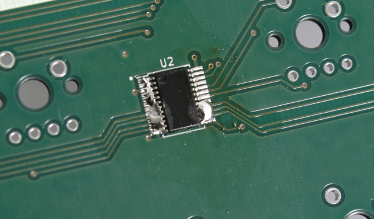

# How to assemble the DIY MEGA65 keyboard

_Images are clickable for a larger (full res) version_

## 1. Get the parts

Get the board from a reliable source or order some to your preferred manufacturer from this KiCad project.

* Inspect the board for any defect\

* Get the components from your preferred supplier\

## 2. Assembly ( Get you soldering iron ready ! )

### 2.1 The RGB LEDs

1. Place the RGB LED in the correct orientation (see datasheet if not sure) on the board´s pads around the view-through hole.\

2. While holding it as steadily as possible with small tweezers, apply a first point of solder.\

3. Then solder the remaining 3 pads.
4. Proceed likewise with the 3 other RGB LEDs.

### 2.2 The TCA/PCA9555s

1. Place a first TCA/PCA9555 chip on its pads.\

2. While holding it, draw a blob of solder across the pads on one side.\

\
Do the same for the other side.
3. Apply a lot of flux on the pads, and draw repeatedly the cleaned iron tip to remove the excess solder from them.\
\
You can help the removal with a copper braid.\
Note that for the cleaning part, I had to raise the iron temperature to 400°C.
And afterwards, my tip was so burnt it needed a lot of regenerative cleaning... 
4. Repeat the process for all the other chips.

### 2.3 The resistors

1. Prepare your resistor by bending their leads to around 10mm apart.\

2. Put them at their spot, bending their legs outwards to prevent them falling when flipping the board for soldering.

3. Solder them gently ensuring a good wetting on the lead and make the solder sink in the holes.\
\
Recommended tip temperature : between 250°C and 300°C
4. Cut the leads as close to the board as possible. (no picture here, but next ones will show that)

### 2.4 The connectors

### 2.5 The key switches

1. Place the standard key switches of your choice on the front side of the board, leaving out the Caps Lock and Shift Lock free.\
Place the two "clicky" key switches at the Caps Lock and Shift Lock positions.\

2. Return the board by placing a large cardboard on the switches, to prevent them from falling off if they don't have retaining studs.

3. Solder all the contacts.\

### 2.6 Now is a good time to test the keyboard

Now that all major components are in place, you can hook up the keyboard with a 10 conductors flat cable to your MEGA65 board or your DIY FPGA board.

Start your MEGA65 and check that the new keyboard has been detected.
Go to the keyboard test utility (hold Alt at power up and select **3. KEYBOARD TEST**), and try every key.

### 2.7 The "lock" switches LEDs

Insert the two 3mm LEDs in the dedicated holes of the clicky keys.
With the MEGA65 turned on, test the Caps Lock and Shift Lock keys to check that the LEDs toggle correctly.
If any LED doesn't illuminate, try reversing it in its slot. Polarity may have been wrong.

Once you're confident the lock LEDs work correctly, turn off the MEGA65, unplug the keyboard and solder them.

### 2.8 The stabilizer bars

Place the Return and Space Bar stabilizer bars on the board, securing them gently with 2 screws on the back.

### 2.9 And finally, fit the keycaps

Now, I guess you didn't wait for this last step.
But if you did, it's now time to place all the keycaps on the board, and start enjoying your new keyboard !!!

## 3. Have fun !